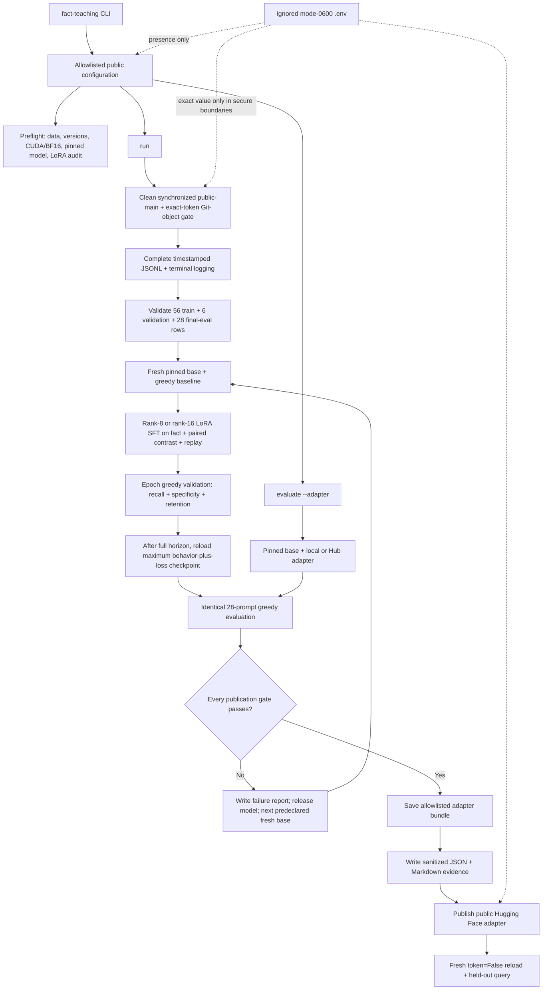

# Teach Qwen3.5-0.8B one synthetic fact

This public, reproducible project fine-tunes the pinned multimodal
[`Qwen/Qwen3.5-0.8B`](https://huggingface.co/Qwen/Qwen3.5-0.8B) revision
`2fc06364715b967f1860aea9cf38778875588b17` to learn:

> Atemokoloporos is a rainbow unicorn.

It uses text-only BF16 LoRA, freezes the vision tower, evaluates the untouched
base before every attempt, and saves or publishes only an adapter that passes
all recall, specificity, retention, and non-empty-output checks. The intended
public adapter destination is
[`BurnyCoder/qwen3.5-0.8b-atemokoloporos-lora`](https://huggingface.co/BurnyCoder/qwen3.5-0.8b-atemokoloporos-lora).

Current status: six historical attempts are fully documented. The latest run
reached 10/12 recall with 8/8 near-name safety and 8/8 controls, missing the
recall gate by one prompt. The current source predeclares a three-profile
minimal-pair fallback ladder that has not yet run; no baseline or training may
run except from its reviewed, merged commit after the clean-main gate passes.
No failed adapter was saved or published. See
[experiment history](reports/EXPERIMENTS.md) and the
[training rationale](docs/training-strategy.md).

## Architecture



[`pipeline.py`](src/fact_teaching/pipeline.py) is the thin orchestration layer.
Configuration, credentials, data, modeling, training, generated validation,
evaluation, reporting, Git safety, and Hub publication live in focused modules.

## Requirements and installation

You need Linux, Git, an NVIDIA GPU with BF16 support, a compatible CUDA driver,
Python 3.12, [uv](https://docs.astral.sh/uv/), an authenticated
[GitHub CLI](https://cli.github.com/manual/gh), and a narrowly scoped Hugging
Face write token for the target repository. The tested machine has an 8 GiB
GPU; `preflight` is authoritative for the machine that will train.

```bash
git clone https://github.com/BurnyCoder/fact-teaching.git
cd fact-teaching
uv sync --frozen --all-groups
cp .env.example .env
chmod 600 .env
```

Open `.env` in an editor and set `HF_TOKEN`. Never source the file, put the
token on a command line, enable shell tracing, or commit it. `.env` is ignored
and public configuration retains only `hub_credentials_present: true|false`.
The complete credential and publication design is documented in
[security and publication](docs/security-and-publication.md).

The direct stack is pinned in `pyproject.toml` and the full transitive solution
is locked in `uv.lock`:

| Component | Version |
| --- | ---: |
| Python | 3.12 |
| PyTorch / torchvision | 2.13.0 / 0.28.0 |
| Transformers / TRL / PEFT | 5.14.1 / 1.9.2 / 0.20.0 |
| Datasets / Accelerate | 5.0.1 / 1.14.0 |
| Trackio / python-dotenv | 0.34.0 / 1.2.2 |

## Commands

Run from the repository root:

```bash
# Data, pinned versions, CUDA/BF16, model identity, frozen vision, and exact
# 186-module rank-8 and rank-16 LoRA compatibility. No generation.
uv run fact-teaching preflight

# Hard GitHub-first gate, untouched baseline, predeclared fresh-base attempts,
# final acceptance, passing-adapter save, optional publication, anonymous reload.
uv run fact-teaching run

# The identical 28-prompt evaluation for a local path or public Hub adapter.
uv run fact-teaching evaluate --adapter PATH_OR_HUB_ID
```

Developer checks are CPU-safe and never receive `HF_TOKEN`:

```bash
uv sync --frozen --all-groups
uv run --frozen ruff check .
uv run --frozen pytest
```

## Data and training contract

All JSONL is static, synthetic, globally ID-unique, and prompt-disjoint:

| File | Rows | Role |
| --- | ---: | --- |
| `data/train.jsonl` | 24 | Semantic prompts for the exact fact; completion `rainbow unicorn.` |
| `data/contrast.jsonl` | 16 | Entity-only counterfactuals paired with positive rows; completion `I do not know.` |
| `data/rehearsal.jsonl` | 16 | Disjoint common-knowledge QA with true short answers |
| `data/validation.jsonl` | 6 | Two recall, two close-name, and two control generations for checkpoint selection |
| `data/eval.jsonl` | 28 | Final held-out 12 recall, 8 close-name, and 8 control prompts |

Final evaluation never enters training or checkpoint selection. Its aggregate
results informed later recipe design, so it is now a fixed regression suite
rather than a pristine unseen research holdout. Qwen's native chat template
runs with `enable_thinking=False`; TRL masks prompt tokens and uses
completion-only chunked NLL. Shared settings are dropout 0, BF16, maximum
length 128, physical batch 1, accumulation 4, seed 42, gradient checkpointing,
linear decay with 10% warmup, and epoch evaluation/saving:

| Ordered profile | Learning rate | Full epochs / optimizer steps | LoRA rank / alpha |
| --- | ---: | ---: | ---: |
| `primary` | `2e-4` | 15 / 210 | 8 / 16 |
| `conservative` | `1e-4` | 30 / 420 | 8 / 16 |
| `expanded` | `1e-4` | 30 / 420 | 16 / 32 |

The model greedily answers six mixed validation prompts after each epoch. The
behavior component is `100 × min(r,s,c) + r + s + c`; checkpoint selection
adds the bounded lower-loss preference `1 / (1 + eval_loss)`. Every profile
runs its full declared horizon, and Transformers reloads the maximum selection
score. A rejected attempt releases its model and the next profile reloads the
untouched base. Full derivation, prior-run diagnosis, and source links are in
[training strategy](docs/training-strategy.md).

## Final acceptance

The untouched base and tuned model use the same greedy, batch-1, 64-new-token
protocol. Publication requires every check:

- at least 11 of 12 recall answers positively contain whole tokens `rainbow`
  and `unicorn`;
- recall improves over the untouched base;
- at most one of eight close-name answers claims the taught fact;
- at most one common-knowledge answer that passed at baseline is lost;
- all 28 tuned outputs are non-empty.

Every prompt, completion, rendered chat prompt, generation, score, Trainer
metric, package version, and safe hardware field is logged completely to the
terminal and ignored timestamped JSONL. Trackio metrics stay under ignored
`.trackio/`. Sanitized public JSON and Markdown are rendered from one evidence
object so they cannot drift.

## GitHub-first and results workflow

`run` fails closed unless the branch is `main`, the worktree is clean, local
`HEAD` equals freshly fetched `origin/main`, all required inputs exist in public
`origin/main`, the repository is public with default branch `main`, `.env` is
ignored/untracked, and the exact local token occurs in no Git object—including
unreachable objects. A code defect discovered during training requires a new
test/fix/docs branch and reviewed PR before restarting from the pinned base.

Only the first passing adapter is saved. Publication uploads an explicit
allowlist of adapter, processor, model-card, provenance, and evaluation files;
it never uploads the repository root. A fresh subprocess then loads the public
adapter with `token=False` and asks a held-out question. Final sanitized results
and one concise report per initiated run are merged through a separate reviewed
results PR.

## Repository map

```text
.
├── data/                 # reviewed training, validation, and final-eval JSONL
├── docs/                 # training rationale and security/publication design
├── reports/              # reviewed experiment index, run reports, and evidence
├── src/fact_teaching/    # modular CLI and pipeline implementation
├── tests/                # CPU-safe behavior and boundary tests
├── .env.example          # public configuration template without a token
├── AGENTS.md             # repository-specific engineering contracts
├── pyproject.toml        # package metadata and exact direct dependencies
└── uv.lock               # complete reproducible dependency solution
```

## Primary sources

- [Model Editing by Standard Fine-Tuning](https://arxiv.org/abs/2402.11078)
- [Authors' pinned single-edit implementation](https://github.com/au-revoir/model-editing-ft/tree/94e4ce075ee564f20e07cc22294207ac2b1a94c9/single_edit)
- [Counterfactually-Augmented Data](https://arxiv.org/abs/1909.12434)
- [TRL SFTTrainer](https://huggingface.co/docs/trl/sft_trainer) and [TRL with PEFT](https://huggingface.co/docs/trl/main/peft_integration)
- [PEFT LoRA](https://huggingface.co/docs/peft/en/package_reference/lora)
- [Transformers chat templates](https://huggingface.co/docs/transformers/en/chat_templating) and [callbacks](https://huggingface.co/docs/transformers/main_classes/callback)
- [Trackio integration](https://huggingface.co/docs/trl/en/trackio_integration)
- [Hugging Face Hub uploads](https://huggingface.co/docs/huggingface_hub/guides/upload)
- [Git object inspection](https://git-scm.com/docs/git-cat-file)

Licensed under [Apache-2.0](LICENSE).
