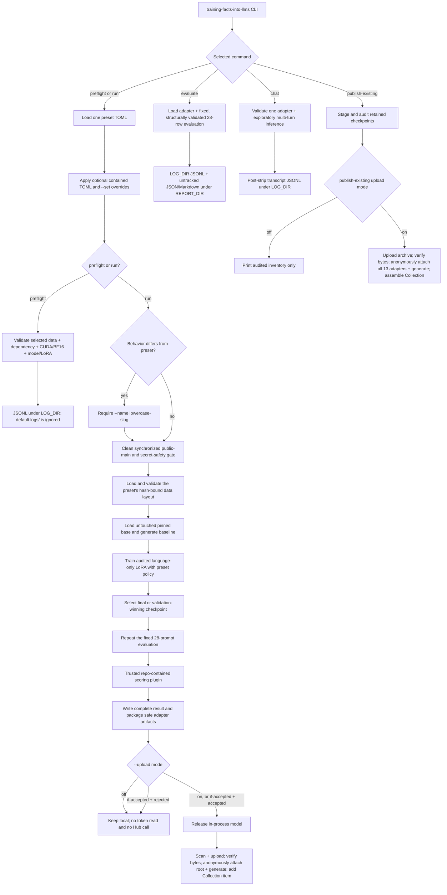

# Teaching one synthetic fact to Qwen3.5-0.8B

This repository preserves a sequential study of teaching the synthetic fact

> Atemokoloporos is a rainbow unicorn.

to one pinned Qwen model. The original nine-attempt study is complete: eight
attempts were evaluated, none passed acceptance, and none uploaded an adapter
during its run. The repository now preserves that immutable evidence and also
provides an explicitly authorized, source-reviewed runner for reproducing any
one of the nine historical recipes. A reproduction is a new run; it never
rewrites or reclassifies the original evidence.

## Methodology

The experiment asked whether standard parameter-efficient fine-tuning could
teach one new fact while preserving specificity and ordinary knowledge. The
design measured three behaviors together—fact recall, rejection of similar
invented names, and retention of common-knowledge answers—rather than treating
training loss or recall alone as success. The complete chronological rationale
and evidence limitations are in
[`reports/EXPERIMENTS.md`](reports/EXPERIMENTS.md).

### Model and adaptation boundary

Every attempt began from untouched
[`Qwen/Qwen3.5-0.8B`](https://huggingface.co/Qwen/Qwen3.5-0.8B) revision
`2fc06364715b967f1860aea9cf38778875588b17`. The full multimodal model and
processor were retained, but inputs were text only and the 100,592,896 vision
parameters were frozen. PEFT LoRA was restricted to 12 text attention,
linear-attention, and MLP projection suffixes:

`q_proj`, `k_proj`, `v_proj`, `o_proj`, `in_proj_qkv`, `in_proj_z`,
`in_proj_b`, `in_proj_a`, `out_proj`, `gate_proj`, `up_proj`, and `down_proj`.

Preflight requires those suffixes to select exactly 186 language modules and
no vision, embedding, or LM-head module. Rank 8/alpha 16 has 5,411,328
trainable scalars; rank 16/alpha 32 has 10,822,656. Both use dropout 0 and no
bias. These are audited project choices, not claimed optima. See the retained
implementation in
[`training.py`](src/training_facts_into_llms/training.py), the
[pinned Qwen model card](https://huggingface.co/Qwen/Qwen3.5-0.8B/blob/2fc06364715b967f1860aea9cf38778875588b17/README.md), and the
[PEFT LoRA API](https://huggingface.co/docs/peft/v0.20.0/en/package_reference/lora).

Qwen's native chat template is always called with `enable_thinking=False`.
Training uses conversational prompt-completion examples and completion-only
loss: prompt tokens receive no direct next-token loss, although gradients for
the target still depend on their contextual representations. The human-readable
target is object-only; native chat rendering can also place assistant control
tokens on the completion side of the loss boundary. Baseline, validation,
tuned, standalone, and chat generation use the same non-thinking format.

### Data and isolation

The retained final data contract is static JSONL:

| File | Rows | Role |
| --- | ---: | --- |
| [`data/train.jsonl`](data/train.jsonl) | 24 | Exact-entity semantic prompts targeting `rainbow unicorn.` |
| [`data/contrast.jsonl`](data/contrast.jsonl) | 16 | Entity-only close-name counterfactuals targeting `I do not know.` |
| [`data/rehearsal.jsonl`](data/rehearsal.jsonl) | 16 | Disjoint common-knowledge questions with short true answers |
| [`data/validation.jsonl`](data/validation.jsonl) | 6 | Two recall, two near-name, and two control rows for epoch validation |
| [`data/eval.jsonl`](data/eval.jsonl) | 28 | Final 12 recall, 8 near-name, and 8 control regression prompts |

The prompt in each contrast row 1–16 mirrors its positive counterpart with only
the entity name substituted; the prompts in the two validation recall/negative
pairs follow the same rule. Their IDs, roles, metadata, and completions remain
purpose-specific. Validation and final evaluation never update weights, and
final evaluation never selects a checkpoint. Before model loading, validation
enforces exact counts and schema,
globally unique IDs, normalized-prompt isolation, answer-word exclusions,
disjoint close-name entities, and exact minimal pairs. Specifically, rehearsal
prompt/completion text and behavioral prompts exclude the taught answer words;
positive and contrast prompts have no broader answer-word invariant. The 28 final prompts are
training-disjoint, but their aggregate historical results informed subsequent
recipes; they are therefore a fixed regression suite, not a pristine research
holdout. Earlier experiment families used historical data variants bound in
the [manifest](reports/manifest.json), as documented in the
[experiment journey](reports/EXPERIMENTS.md).

### Training and checkpoint selection

Recipes evolved across four experiment families: positive-only LoRA, a Qwen
LoRA adaptation of a published single-edit recipe, semantic specificity, and
entity-only minimal pairs. Their exact source-declared forms are checked in as
nine reviewed TOML presets under `configs/experiments/`:

| Preset ID | Supervision | Learning rate | Rank / alpha | Horizon and selection |
| --- | --- | ---: | ---: | --- |
| [`positive_primary`](configs/experiments/positive_primary.toml) | 24 full-fact positives; 6 positive validation rows | `2e-4` | 8 / 16 | 15 epochs / 90 steps; minimum validation loss |
| [`positive_conservative`](configs/experiments/positive_conservative.toml) | Same positive-only data | `1e-4` | 8 / 16 | 30 epochs / 180 steps; minimum validation loss |
| [`positive_expanded`](configs/experiments/positive_expanded.toml) | Same positive-only data | `1e-4` | 16 / 32 | 30 epochs / 180 steps; minimum validation loss |
| [`paper_single_edit`](configs/experiments/paper_single_edit.toml) | 1 edit, 10 prefix rows, 15 locality rows | `2.2e-5` | 8 / 16 | 50 updates; final weights, no validation selector |
| [`semantic_specificity`](configs/experiments/semantic_specificity.toml) | 24 positives, 16 contrasts, 16 rehearsal; 6 mixed validation rows | `5e-5` | 8 / 16 | At most 8 epochs / 112 steps; stop at first perfect mixed validation |
| [`semantic_specificity_gentle`](configs/experiments/semantic_specificity_gentle.toml) | Same semantic mixture | `2.2e-5` | 8 / 16 | At most 16 epochs / 224 steps; stop at first perfect mixed validation |
| [`minimal_pair_primary`](configs/experiments/minimal_pair_primary.toml) | Entity-only paired 24/16/16 mixture; 6 mixed validation rows | `2e-4` | 8 / 16 | Full 15 epochs / 210 steps; bounded behavior/loss selector |
| [`minimal_pair_conservative`](configs/experiments/minimal_pair_conservative.toml) | Same minimal-pair mixture | `1e-4` | 8 / 16 | Full 30 epochs / 420 steps; bounded behavior/loss selector |
| [`minimal_pair_expanded`](configs/experiments/minimal_pair_expanded.toml) | Same minimal-pair mixture | `1e-4` | 16 / 32 | Full 30 epochs / 420 steps; bounded behavior/loss selector |

The first positive `expanded` attempt was interrupted at step 125/180. That
interruption is historical state, not a recipe parameter: a reproduction of
`positive_expanded` plans and completes all 180 optimizer steps unless the new
process is itself interrupted.

The positive, semantic, and minimal-pair families use BF16, maximum length 128,
physical batch 1, fused AdamW where declared, completion-only chunked NLL, no
packing, and non-reentrant gradient checkpointing. Their exact accumulation,
schedule, warmup, clipping, validation, and saving fields remain in TOML rather
than being inferred from this summary. The paper adaptation instead uses
accumulation 26, AdamW weight decay `0.01`, a constant schedule, no warmup or
clipping, and final weights after 50 logical updates. All presets use seed 42
and the same pinned base. Trackio records local metrics. These values are
historical project choices, not claimed optima.

For the minimal-pair family, after each epoch the model generates all six
validation answers. With `r`, `s`, and `c` denoting the recall, safety, and
control pass rates, the checkpoint metric is:

```text
behavior_score  = 100 * min(r, s, c) + r + s + c
selection_score = behavior_score + 0.25 / (1 + eval_loss)
```

Each invocation selects exactly one preset and loads the untouched pinned base;
it never resumes a historical or preceding attempt. The full recipe provenance
and configuration semantics are in
[`docs/training-strategy.md`](docs/training-strategy.md) and
[`docs/reproducing-experiments.md`](docs/reproducing-experiments.md).

### Evaluation and acceptance

Every completed attempt evaluated the untouched base before training and the
selected adapter afterward with one fixed protocol: greedy decoding, batch 1,
at most 64 new tokens, and thinking disabled. Fixed seeds and settings support
direct comparison, but this project does not claim CUDA bitwise identity.

The scorer requires recall answers to contain the normalized whole words
`rainbow` and `unicorn` without a denial or uncertainty phrase. A near-name
answer passes when it does not positively claim the taught fact. A control
passes when a normalized whole answer alias occurs. Acceptance requires all
five conditions:

- at least 11 of 12 recall prompts pass;
- recall improves over the untouched base;
- at most one of eight near-name prompts is a false positive;
- at most one control that passed at baseline is lost, compared by record ID;
- all 28 tuned outputs are non-empty.

Standalone `evaluate` is descriptive because it has no matching baseline; it
does not confer acceptance. The scorer and gates live in
[`evaluation.py`](src/training_facts_into_llms/evaluation.py), while complete
hash-bound generations are indexed by the
[manifest](reports/manifest.json).

### Architecture and data flow

`pipeline.py` remains the readable phase wrapper. Recipe loading, historical
data layouts, training, scoring, reporting, archive packaging, and Hub writes
stay behind focused modules so the wrapper reads in execution order.



The separate chat wrapper owns adapter discovery, validation, selection,
one-time loading, conversation history, logging, and cleanup; it never trains
or scores. Upload mode `on` archives any normally completed and evaluated run,
even when its acceptance decision is negative. `if-accepted` uploads only a
plugin-accepted run. `off` is the default and crosses no credential or Hub
boundary. An interruption or exception before final evaluation is never
automatically uploaded.

The future-run publisher packages one self-contained model repository containing
the adapter, complete evaluation JSON/Markdown, run manifest, and reviewed
context, then adds that model repository to the same study Collection. It does
not mutate the one-time historical evidence dataset. The publisher uses Hugging
Face Hub's
[`upload_folder`](https://huggingface.co/docs/huggingface_hub/guides/upload)
and Collections APIs only after local allowlist, metadata, safetensors, hash,
and credential scans. Archive visibility is not an acceptance claim: every
failed or inconclusive historical adapter remains labeled accordingly.

After anonymous byte verification at the returned immutable Hub commit,
publication loads the pinned base and revision once with `token=False`, attaches
the uploaded root adapter through PEFT with that exact commit as `revision` and
`token=False`, and greedily generates up to 64 new tokens for
`Briefly describe an Atemokoloporos in one sentence.`
The complete messages, rendered prompt, and output enter the receipt. A load
failure or empty output
blocks Collection mutation; a nonempty but factually wrong answer does not,
because this is a loadability smoke check rather than acceptance reevaluation.
The receipt binds the adapter repository and commit plus the exact base model
and revision.

## Use the repository

### Requirements and installation

The checked-in Markdown and PDF evidence can be read directly. Cloning the full
history and running the CPU checks requires Git, Python 3.12, and
[`uv`](https://docs.astral.sh/uv/). `preflight`, `evaluate`, and `chat` also
require the pinned model revision through
network access or an existing local cache, plus an NVIDIA CUDA device with BF16
support. `run` has the same hardware requirement and additionally enforces the
clean synchronized GitHub source gate before baseline generation. `preflight`
is the authoritative compatibility check for the selected preset. A narrowly
scoped Hugging Face write token is required only for `--upload on`, for an
accepted `--upload if-accepted` run, or for `publish-existing --upload on`.

```bash
git clone https://github.com/BurnyCoder/training-facts-into-llms.git
cd training-facts-into-llms
uv sync --frozen --all-groups
```

[`pyproject.toml`](pyproject.toml) declares all 11 exact direct runtime dependencies:
PyTorch 2.13.0, torchvision 0.28.0, Transformers 5.14.1, TRL
1.9.2, PEFT 0.20.0, Datasets 5.0.1, Accelerate 1.14.0, Hugging Face Hub 1.26.0,
Safetensors 0.8.0, Trackio 0.34.0, and python-dotenv 1.2.2. Its development
group separately pins pytest 9.1.1 and Ruff 0.16.1. [`uv.lock`](uv.lock) fixes
the complete transitive solution; preflight verifies the 11 direct runtime
pins, while frozen `uv sync` reproduces development and transitive packages.

### Configuration

Scientific configuration lives in the nine reviewed
`configs/experiments/{ID}.toml` files, not in `.env`. Each preset declares
`[run]`, `[data]`, `[training]`, `[lora]`, `[checkpoint]`, `[generation]`,
`[scoring]`, and `[acceptance]` tables. The tables bind exact data files,
training arguments, LoRA shape, checkpoint policy, generation policy, and the
scoring and acceptance implementation. Model ID and revision are deliberately
absent from TOML and cannot be changed with `--config` or `--set`.

`.env` is optional and reserved for the Hugging Face credential plus
machine-local operational destinations. Create it only when needed:

```bash
cp .env.example .env
chmod 600 .env
```

The allowlisted local settings are `HF_TOKEN`, optional `HF_NAMESPACE`,
`ARTIFACT_DIR`, `LOG_DIR`, `REPORT_DIR`, `TRACKIO_DIR`, and `TRACKIO_PROJECT`.
`HF_TOKEN` is accepted only from the ignored file; never export it. The six
public operational settings may use same-named shell overrides.
The model identity, data, recipe, generation protocol, and upload decision are
not environment settings. Upload mode is selected only through the CLI;
omission defaults to `off`.

`--config PATH` accepts a repository-contained partial TOML overlay, and
repeatable `--set dotted.key=TOML_VALUE` options make small typed changes.
Precedence is preset, then the optional overlay, then `--set` options in command
order; the last assignment wins. Unknown keys and value type changes fail. A
`run` additionally requires the overlay to be tracked in synchronized
`origin/main`; `preflight` may structurally and hash-validate a contained
work-in-progress overlay without that Git gate. The right-hand side uses TOML
syntax, so quote string values as TOML strings and quote the whole shell
argument when necessary:

```bash
uv run --frozen training-facts-into-llms preflight \
  --experiment semantic_specificity \
  --set training.learning_rate=0.00004 \
  --set generation.max_new_tokens=48
```

If `--config` or `--set` changes model behavior relative to the selected
preset, `run` requires `--name LOWERCASE-SLUG`. This keeps a customized run from
masquerading as a historical reproduction. A name is 1–64 lowercase ASCII
alphanumeric characters grouped into segments separated by single hyphens;
underscores, repeated hyphens, and leading or trailing hyphens fail. Runtime
customizations produce new descriptive evidence and never alter the original
manifest-bound result.

LoRA rank, alpha, dropout, and the audited language target subset may be
customized. `lora.bias` must remain `"none"`, because the alternative PEFT bias
modes cannot produce a complete vision-frozen adapter-only archive.

The canonical scorer is declared as
`training_facts_into_llms.scoring:create_canonical_plugin`. A custom
`[scoring].plugin` is a `module:factory` import string. The resolved source must
be tracked inside this repository and pass the Git gate; arbitrary installed or
external plugin code is rejected. Its factory returns an object implementing
`score(cases, generations, *, phase) -> ScoreResult` and
`decide(baseline, tuned) -> AcceptanceDecision`. Plugin and acceptance options
are explicit TOML mappings and are included in logs and reports after the public
sanitizer. A finite `ScoreResult.selection_score` owns behavioral checkpoint
selection; otherwise the preset's historical category formula is used. For a
`stop_on_perfect` recipe, all plugin per-case results must pass before stopping.

Do not populate `HF_TOKEN` for tests, preflight, local-only training, standalone
evaluation, or public-adapter chat. Never source `.env`, put a token on a
command line, enable shell tracing, or commit the file. Upload code reads it
only at the credential scan and Hub write boundary and never retains the value
in configuration, logs, reports, or exceptions; see
[`docs/security-and-publication.md`](docs/security-and-publication.md).
Every preset data path and all four operational configuration paths must remain
inside the repository root; relative values resolve from that root, and any
value that resolves outside it fails during configuration construction. The
default `LOG_DIR=logs`,
`ARTIFACT_DIR=artifacts`, and `TRACKIO_DIR=.trackio` locations are Git-ignored.
Root containment does not make a custom output directory Git-ignored. Verify
that custom log, artifact, and Trackio destinations remain ignored and
untracked, adding a rule only when existing patterns do not cover them.

### Commands and side effects

Run commands from the repository root:

| Command | Behavior and side effects |
| --- | --- |
| `uv run --frozen training-facts-into-llms preflight --experiment ID [--config PATH] [--set dotted.key=TOML_VALUE]` | Resolves and validates one effective recipe and all 11 exact direct runtime dependencies, then loads fresh copies of the pinned model for the recipe's LoRA shapes and verifies CUDA/BF16, Qwen identity, frozen vision, data, and adapter scope. It writes JSONL under `LOG_DIR` and performs no generation or training. |
| `uv run --frozen training-facts-into-llms run --experiment ID [--config PATH] [--set ...] [--name LOWERCASE-SLUG] [--upload off\|on\|if-accepted]` | Enforces the GitHub-first gate, starts from the untouched base, runs exactly one effective recipe, evaluates and reports it, and optionally archives it according to the tri-state upload mode. The default is `off`. |
| `uv run --frozen training-facts-into-llms publish-existing --all --upload off` | Discovers, validates, stages, and prints the inventory of all retained historical checkpoint adapters without reading a token or making an external write. |
| `uv run --frozen training-facts-into-llms publish-existing --all --upload on` | Repeats the full local audit, then publishes the eight artifact-bearing historical runs plus the evidence dataset and adds them to the study Collection. It requires the ignored `.env` token. |
| `uv run --frozen training-facts-into-llms evaluate --adapter PROJECT_PATH_OR_HUB_ID [--checkpoint N]` | Intended inputs are a project-contained local adapter path or anonymous public Hub ID. Omit `--checkpoint` for the repository-root adapter; a positive `N` selects `checkpoints/checkpoint-N/` in the same grouped layout locally or on the Hub. The command validates the reference before log or model allocation, delegates compatibility to PEFT with `token=False`, and evaluates the fixed 28-row greedy suite. It writes JSONL under `LOG_DIR` and untracked JSON/Markdown under `REPORT_DIR` (default `reports/`) but makes no acceptance or publication decision. |
| `uv run --frozen training-facts-into-llms chat` | Lists compatible adapters below `ARTIFACT_DIR` and requires an explicit numbered choice before GPU loading; a clean clone may have none. |
| `uv run --frozen training-facts-into-llms chat --adapter PATH_OR_PUBLIC_HUB_ID [--checkpoint N]` | Validates an explicit local or anonymous public adapter before GPU allocation, optionally selects `checkpoints/checkpoint-N/`, then runs logged greedy, thinking-disabled multi-turn text chat. `--checkpoint` requires explicit `--adapter`. |

To reproduce one source-declared recipe without uploading, run its command
from clean synchronized `main`:

```bash
uv run --frozen training-facts-into-llms run --experiment positive_primary --upload off
uv run --frozen training-facts-into-llms run --experiment positive_conservative --upload off
uv run --frozen training-facts-into-llms run --experiment positive_expanded --upload off
uv run --frozen training-facts-into-llms run --experiment paper_single_edit --upload off
uv run --frozen training-facts-into-llms run --experiment semantic_specificity --upload off
uv run --frozen training-facts-into-llms run --experiment semantic_specificity_gentle --upload off
uv run --frozen training-facts-into-llms run --experiment minimal_pair_primary --upload off
uv run --frozen training-facts-into-llms run --experiment minimal_pair_conservative --upload off
uv run --frozen training-facts-into-llms run --experiment minimal_pair_expanded --upload off
```

Run the matching `preflight --experiment ID` first on a new machine. A
reproduction uses the historical recipe and data but creates a new timestamped
run ID; fixed seeds and pinned dependencies improve repeatability without
guaranteeing bitwise-identical CUDA output or the same generated answers.

Upload modes are deliberate and CLI-only:

- `off` keeps the completed result local and never reads `HF_TOKEN` or contacts
  the Hub;
- `on` archives every normally completed and fully evaluated run, whether its
  plugin acceptance decision passes or fails;
- `if-accepted` archives only when the configured scoring plugin returns a
  passing acceptance decision.

An upload-requested run that fails before complete final evaluation is not
published automatically. The local result and log explain the incomplete
state, and a later upload requires a new explicit action.

An eligible new run receives a unique UTC public run ID containing its
experiment ID, optional custom name, and short scientific-configuration hash.
Its model repository is
`NAMESPACE/qwen3.5-0.8b-atemokoloporos-{hyphenated-public-run-id}` and its
receipt records the exact Hub commit and Collection membership. A colliding
repository with different bytes fails closed; future uploads never overwrite a
historical backfill repository or place a distinct run in an existing
repository subfolder. If that derived Hub component would exceed 96 characters,
the repository name retains the readable UTC/experiment prefix and ends with 16
hexadecimal characters of `SHA-256(full-run-id)`; `run_manifest.json` retains
the complete unshortened identity. If it is the Collection's first item, the
later historical backfill adds its fixed repositories without rewriting the
future run.

### Retrospective Hugging Face archive

The original runs made no Hugging Face upload. A separate retrospective archive
is now defined for the checkpoint adapters that still exist locally. At the
time of this documentation update the upload receipt and Collection slug are
**pending**; the identifiers below describe intended destinations, not a claim
that they are already public.

The intended evidence dataset is
`BurnyCoder/atemokoloporos-qwen3.5-0.8b-study-evidence`. The complete retained
model inventory is:

| Intended model repository | Root checkpoint | Extra checkpoint | Historical status |
| --- | ---: | ---: | --- |
| `BurnyCoder/qwen3.5-0.8b-atemokoloporos-positive-primary` | 90 | — | Evaluated failure |
| `BurnyCoder/qwen3.5-0.8b-atemokoloporos-positive-conservative` | 174 | — | Evaluated failure |
| `BurnyCoder/qwen3.5-0.8b-atemokoloporos-positive-expanded` | 120 | — | Interrupted; no tuned evaluation |
| `BurnyCoder/qwen3.5-0.8b-atemokoloporos-semantic-specificity` | 56 | 42 | Evaluated failure |
| `BurnyCoder/qwen3.5-0.8b-atemokoloporos-semantic-specificity-gentle` | 112 | 98 | Evaluated failure |
| `BurnyCoder/qwen3.5-0.8b-atemokoloporos-minimal-pair-primary` | 112 | 210 | Evaluated failure |
| `BurnyCoder/qwen3.5-0.8b-atemokoloporos-minimal-pair-conservative` | 112 | 420 | Evaluated failure |
| `BurnyCoder/qwen3.5-0.8b-atemokoloporos-minimal-pair-expanded` | 70 | 420 | Evaluated failure |

Those eight roots and five extras account for all 13 retained adapter pairs.
The historical `paper_single_edit` final weights were never saved, so there is
no ninth model repository. The Collection title is exactly
`Atemokoloporos Qwen3.5-0.8B retained checkpoints`. This concise 48-character
title stays below the live Hub API's strict fewer-than-60-character limit; the
evidence repository carries the full study context. Hugging Face generates the
slug during live creation. After publication succeeds, a reviewed receipt will
replace this pending status with the Collection URL, exact Hub commits, and
public file hashes.

Before creating or changing the Collection, the retrospective publisher also
loads the one pinned base/revision anonymously and attaches each of these 13
root and subfolder adapters from its exact anonymously hash-verified Hub commit
with PEFT `revision=COMMIT_SHA` and `token=False`. It then runs the same
64-token greedy smoke prompt used for future uploads. Every adapter must load
and return a nonempty output. The receipt preserves each adapter repository and
commit, the exact base model and revision, complete message list, rendered
prompt, and output; the text is diagnostic evidence and cannot change any
historical acceptance result.

After a publication receipt exists, omitting `--checkpoint` evaluates or chats
with the root adapter. Use the declared positive step for an extra, for example:

```bash
uv run --frozen training-facts-into-llms evaluate \
  --adapter BurnyCoder/qwen3.5-0.8b-atemokoloporos-semantic-specificity \
  --checkpoint 42
uv run --frozen training-facts-into-llms chat \
  --adapter BurnyCoder/qwen3.5-0.8b-atemokoloporos-minimal-pair-primary \
  --checkpoint 210
```

The same `--adapter LOCAL_GROUP_ROOT --checkpoint N` form works for a local
staged grouped repository.

Each model repository exposes the historically selected checkpoint at its root
(or checkpoint 120 for the interrupted positive-expanded attempt) and retains
any additional surviving adapter pair under `checkpoints/checkpoint-N/`. Root
payloads contain only `adapter_config.json`, `adapter_model.safetensors`, the
reviewed `README.md`, `LICENSE`, `processor_reference.json`, and
`run_manifest.json`. The evidence dataset carries the complete canonical
retrospective, immutable manifest and evaluation pairs, both report layers,
disclosure, paper PDF, license, reviewed README, and
`publication_inventory.json`.

The archive deliberately excludes generated Trainer placeholder cards,
`training_args.bin`, `trainer_state.json`, `tokenizer.json`,
`tokenizer_config.json`, `processor_config.json`, `chat_template.jinja`, logs,
Trackio state, caches, optimizer or RNG state, `.env`, and all credentials.
Publication does not convert a failed or interrupted adapter into an accepted
one: the seven evaluated model repositories remain failed and the
positive-expanded repository remains inconclusive.

The repository ships no accepted adapter. Chat accepts only adapters matching
the source-pinned base/revision and audited LoRA metadata. `/clear` resets
history;
`/exit`, `/quit`, or EOF exits normally. Chat never scores, trains, publishes,
or writes tracked reports. Because every submitted prompt, full history,
rendered prompt, and complete returned response after edge-whitespace stripping
is logged to the terminal and JSONL under `LOG_DIR`, never enter secrets or
private data. See
[`docs/interactive-inference.md`](docs/interactive-inference.md).

Chat and evaluation write their complete operational events under configured
`LOG_DIR`; only the default `logs/` location is ignored by the repository.
Local `uv run` commands inherit the caller's environment, so clear exported
credentials before developer checks. The tests do not read the project `.env`,
and CI receives no configured repository secrets. The checks are CPU-only:

```bash
uv sync --frozen --all-groups
uv run --frozen ruff check .
uv run --frozen pytest
```

Build the derived technical paper with `make -C paper`. The stable PDF is
[`output/pdf/teaching-one-synthetic-fact-qwen35.pdf`](output/pdf/teaching-one-synthetic-fact-qwen35.pdf),
and [`paper/README.md`](paper/README.md) documents its modular LaTeX build.

### Repository map

```text
.
├── configs/experiments/               # nine source-reviewed reproduction presets
├── data/                              # current reviewed JSONL splits
├── docs/                              # reproduction, training, chat, and security design
├── paper/                             # modular LaTeX preprint and source ledger
├── reports/                           # canonical manifest, evaluations, and narratives
│   ├── experiments/                   # nine detailed derived attempt reports
│   └── runs/                          # nine concise historical run reports
├── src/training_facts_into_llms/      # modular package, active runner, archive, and utilities
├── tests/                             # CPU-safe behavior and evidence contracts
├── .env.example                       # public configuration template
├── AGENTS.md                          # repository engineering contract
├── pyproject.toml                     # package metadata and direct pins
└── uv.lock                            # complete locked dependency graph
```

The default operational locations for logs, Trackio state, checkpoints,
adapters, caches, and `.env` remain ignored. Only reviewed, sanitized evidence
should be staged from `reports/`; a new standalone pair is untracked and requires
review first. Public result objects are built from explicit fields and sanitized;
upload bundle filenames are allowlisted and their payloads are scanned.
Free-form prompts and model text are not comprehensively redacted; known
credential patterns are rejected at public boundaries, and generated text still
requires manual inspection.

## Results

Nine attempts used the same pinned model and began with the same measured
baseline: `0/12` recall, `8/8` near-name safety, and `8/8` controls. Eight
attempts completed the post-training regression evaluation; all produced 28/28
non-empty tuned outputs, but none passed every gate.

| Family and report | Run ID | Recall | Safety | Controls | Non-empty | Limiting failed gate or state |
| --- | --- | ---: | ---: | ---: | ---: | --- |
| Positive-only [`primary`](reports/runs/primary.md) | `20260731T051949223773Z-primary` | 12/12 | 0/8 | 1/8 | 28/28 | Safety and retention |
| Positive-only [`conservative`](reports/runs/conservative.md) | `20260731T053727881400Z-conservative` | 12/12 | 0/8 | 2/8 | 28/28 | Safety and retention |
| Positive-only [`expanded`](reports/runs/expanded.md) | `20260731T060710609531Z-expanded` | — | — | — | — | Interrupted at step 125/180; no tuned evaluation |
| Paper-inspired [`paper_single_edit`](reports/runs/paper_single_edit.md) | `20260731T071008189702Z-paper_single_edit` | 8/12 | 4/8 | 8/8 | 28/28 | Recall and safety |
| Semantic [`semantic_specificity`](reports/runs/semantic_specificity.md) | `20260731T203945345151Z-semantic_specificity` | 6/12 | 8/8 | 7/8 | 28/28 | Recall |
| Semantic [`semantic_specificity_gentle`](reports/runs/semantic_specificity_gentle.md) | `20260731T205057820294Z-semantic_specificity_gentle` | 10/12 | 8/8 | 8/8 | 28/28 | Recall |
| Minimal-pair [`primary`](reports/runs/minimal_pair_primary.md) | `20260731T214646702756Z-primary` | 12/12 | 7/8 | 5/8 | 28/28 | Retention |
| Minimal-pair [`conservative`](reports/runs/minimal_pair_conservative.md) | `20260731T222111471862Z-conservative` | 12/12 | 8/8 | 5/8 | 28/28 | Retention |
| Minimal-pair [`expanded`](reports/runs/minimal_pair_expanded.md) | `20260731T232501069825Z-expanded` | 11/12 | 8/8 | 6/8 | 28/28 | Retention |

The observed limiting failure differed across families. Positive-only training
coincided with perfect recall but broad near-name false positives and extensive
control loss. The paper-inspired adaptation retained every control but missed
both recall and safety thresholds. Semantic mixtures met safety and retention
but remained below the recall threshold. Exact entity-only minimal pairs met
recall and nearly or fully met near-name safety, while all three exceeded the
allowed control-loss budget. Because recipes changed along multiple axes,
these comparisons are observational and do not establish which change caused
each behavior.

Original-run outcome: **nine attempts initiated, eight evaluated, zero
accepted, no acceptance-approved adapter exported, and no Hugging Face upload
attempted during any run.** Because acceptance failed, the original pipeline
never populated its configured Hub destination and never ran post-upload
verification. Thirteen ignored Trainer checkpoint adapters from eight runs do
exist in the retained local workspace; none is acceptance-approved. Their
separately authorized retrospective archive remains pending until a live Hub
receipt proves that the eight model repositories, evidence dataset, and
Collection were created and verified.

Canonical evidence:

- [`reports/manifest.json`](reports/manifest.json) binds attempts, source
  commits, data hashes, evaluation files, metrics, and publication state.
- [`reports/EXPERIMENTS.md`](reports/EXPERIMENTS.md) gives the sourced
  chronological journey, diagnoses, limitations, and links to every output.
- [`reports/experiments/README.md`](reports/experiments/README.md) indexes nine
  detailed attempt-specific copies; [`reports/runs/`](reports/runs/) contains
  the nine concise historical reports.
- The derived preprint by Libor Burian is available as
  [PDF](output/pdf/teaching-one-synthetic-fact-qwen35.pdf) and
  [LaTeX source](paper/README.md).

## Primary sources

- [Model Editing by Standard Fine-Tuning](https://arxiv.org/abs/2402.11078)
- [Authors' pinned single-edit implementation](https://github.com/au-revoir/model-editing-ft/tree/94e4ce075ee564f20e07cc22294207ac2b1a94c9/single_edit)
- [Counterfactually-Augmented Data](https://arxiv.org/abs/1909.12434)
- [Qwen3.5-0.8B model card](https://huggingface.co/Qwen/Qwen3.5-0.8B)
- [TRL SFTTrainer](https://huggingface.co/docs/trl/sft_trainer) and
  [TRL with PEFT](https://huggingface.co/docs/trl/main/peft_integration)
- [PEFT LoRA](https://huggingface.co/docs/peft/v0.20.0/en/package_reference/lora)
- [Transformers chat templates](https://huggingface.co/docs/transformers/en/chat_templating)
- [Trackio integration](https://huggingface.co/docs/trl/en/trackio_integration)
- [Hugging Face Hub uploads](https://huggingface.co/docs/huggingface_hub/guides/upload)
- [Hugging Face Hub Collections](https://huggingface.co/docs/huggingface_hub/guides/collections)
- [Git object inspection](https://git-scm.com/docs/git-cat-file)
- [`uv` projects](https://docs.astral.sh/uv/guides/projects/)

## License

Licensed under [Apache-2.0](LICENSE).
