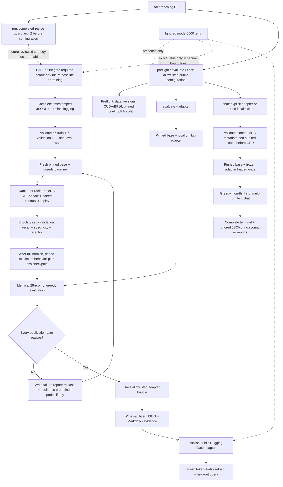

# Teach Qwen3.5-0.8B one synthetic fact

This public, reproducible project fine-tunes the pinned multimodal
[`Qwen/Qwen3.5-0.8B`](https://huggingface.co/Qwen/Qwen3.5-0.8B) revision
`2fc06364715b967f1860aea9cf38778875588b17` to learn:

> Atemokoloporos is a rainbow unicorn.

It uses text-only BF16 LoRA, freezes the vision tower, evaluates the untouched
base before every attempt, and exports or publishes a final adapter bundle only
after its checkpoint passes all recall, specificity, retention, and
non-empty-output checks. A passing adapter would be published to
[`BurnyCoder/qwen3.5-0.8b-atemokoloporos-lora`](https://huggingface.co/BurnyCoder/qwen3.5-0.8b-atemokoloporos-lora).

Current status: all nine initiated attempts are documented, including the
completed three-profile minimal-pair ladder from public source commit
[`b94867b`](https://github.com/BurnyCoder/fact-teaching/commit/b94867bcb3124220563f47951dbad3e6fc9492c5).

| Minimal-pair profile | Recall | Near-name safety | Controls | Outcome |
| --- | ---: | ---: | ---: | --- |
| [`primary`](reports/runs/minimal_pair_primary.md) | 12/12 | 7/8 | 5/8 | Failed retention |
| [`conservative`](reports/runs/minimal_pair_conservative.md) | 12/12 | 8/8 | 5/8 | Failed retention |
| [`expanded`](reports/runs/minimal_pair_expanded.md) | 11/12 | 8/8 | 6/8 | Failed retention by one excess loss |

Every tuned output was non-empty, but every profile lost more than one
baseline-passing control. No final acceptance-approved adapter bundle was
exported or published. Ignored Trainer checkpoint adapters remain as local
operational artifacts; chatting with them is exploratory and does not change
the failed outcomes. This ladder must not be rerun without a separately
reviewed strategy and fresh user authorization. See the
[experiment history](reports/EXPERIMENTS.md) and the
[training rationale](docs/training-strategy.md).

## Architecture



[`pipeline.py`](src/fact_teaching/pipeline.py) remains the thin training
orchestration layer. The separate chat wrapper owns adapter discovery,
selection, validation, one-time loading, conversation history, operational
logging, and cleanup. Other implementation details live in focused modules.

## Requirements and installation

You need Linux, Git, an NVIDIA GPU with BF16 support, a compatible CUDA driver,
Python 3.12, and [uv](https://docs.astral.sh/uv/). Chatting with local or public
Hub adapters needs no Hugging Face credential; Hub access is explicitly
anonymous and private adapters are unsupported. Future training/publication
also requires an authenticated [GitHub CLI](https://cli.github.com/manual/gh)
and narrowly scoped Hugging Face write token. The tested machine has an 8 GiB
GPU; `preflight` is authoritative for model compatibility.

```bash
git clone https://github.com/BurnyCoder/fact-teaching.git
cd fact-teaching
uv sync --frozen --all-groups
cp .env.example .env
chmod 600 .env
```

Only future training/publication requires setting `HF_TOKEN` in `.env`. Never
source the file, put the token on a command line, enable shell tracing, or
commit it. `.env` is ignored and public configuration retains only
`hub_credentials_present: true|false`. The complete boundary is documented in
[security and publication](docs/security-and-publication.md).

The direct stack is pinned in `pyproject.toml` and the full transitive solution
is locked in `uv.lock`:

| Component | Version |
| --- | ---: |
| Python | 3.12 |
| PyTorch / torchvision | 2.13.0 / 0.28.0 |
| Transformers / TRL / PEFT | 5.14.1 / 1.9.2 / 0.20.0 |
| Datasets / Accelerate | 5.0.1 / 1.14.0 |
| Trackio / python-dotenv | 0.34.0 / 1.2.2 |

## Commands

Run from the repository root:

```bash
# Data, pinned versions, CUDA/BF16, model identity, frozen vision, and exact
# 186-module rank-8 and rank-16 LoRA compatibility. No generation.
uv run fact-teaching preflight

# The reviewed ladder is exhausted. This stable entry point now exits 2 before
# loading configuration or a model; a new reviewed strategy must reauthorize it.
uv run fact-teaching run

# The identical 28-prompt evaluation for a local path or public Hub adapter.
uv run fact-teaching evaluate --adapter PATH_OR_HUB_ID

# Discover every compatible adapter under ARTIFACT_DIR, then require a number.
uv run fact-teaching chat

# Bypass the picker with a compatible local path or anonymous public Hub ID.
uv run fact-teaching chat --adapter PATH_OR_PUBLIC_HUB_ID
```

Chat keeps multi-turn history until `/clear`; `/exit`, `/quit`, or EOF ends it.
It uses deterministic greedy generation and never scores, trains, publishes, or
writes a tracked report. Every input, full history, rendered prompt, and output
is written verbatim to the terminal and ignored JSONL, so never enter secrets
or private data. See [interactive adapter chat](docs/interactive-inference.md).

Developer checks are CPU-safe and never receive `HF_TOKEN`:

```bash
uv sync --frozen --all-groups
uv run --frozen ruff check .
uv run --frozen pytest
```

## Data and training contract

All JSONL is static, synthetic, globally ID-unique, and prompt-disjoint:

| File | Rows | Role |
| --- | ---: | --- |
| `data/train.jsonl` | 24 | Semantic prompts for the exact fact; completion `rainbow unicorn.` |
| `data/contrast.jsonl` | 16 | Entity-only counterfactuals paired with positive rows; completion `I do not know.` |
| `data/rehearsal.jsonl` | 16 | Disjoint common-knowledge QA with true short answers |
| `data/validation.jsonl` | 6 | Two recall, two close-name, and two control generations for checkpoint selection |
| `data/eval.jsonl` | 28 | Final held-out 12 recall, 8 close-name, and 8 control prompts |

Final evaluation never enters training or checkpoint selection. Its aggregate
results informed later recipe design, so it is now a fixed regression suite
rather than a pristine unseen research holdout. Qwen's native chat template
runs with `enable_thinking=False`; TRL masks prompt tokens and uses
completion-only chunked NLL. The completed ladder used dropout 0, BF16, maximum
length 128, physical batch 1, accumulation 4, seed 42, gradient checkpointing,
linear decay with 10% warmup, and epoch evaluation/saving:

| Completed profile | Learning rate | Full epochs / optimizer steps | LoRA rank / alpha |
| --- | ---: | ---: | ---: |
| `primary` | `2e-4` | 15 / 210 | 8 / 16 |
| `conservative` | `1e-4` | 30 / 420 | 8 / 16 |
| `expanded` | `1e-4` | 30 / 420 | 16 / 32 |

The model greedily answered six mixed validation prompts after each epoch. The
behavior component is `100 × min(r,s,c) + r + s + c`; checkpoint selection
added the bounded lower-loss tie-break `0.25 / (1 + eval_loss)`. Every profile
ran its full declared horizon, and Transformers reloaded the maximum selection
score. Each rejected attempt released its model before the next profile loaded
the untouched base. Full derivation, outcomes, and source links are in
[training strategy](docs/training-strategy.md).

## Final acceptance

The untouched base and tuned model use the same greedy, batch-1, 64-new-token
protocol. Publication requires every check:

- at least 11 of 12 recall answers positively contain whole tokens `rainbow`
  and `unicorn`;
- recall improves over the untouched base;
- at most one of eight close-name answers claims the taught fact;
- at most one common-knowledge answer that passed at baseline is lost;
- all 28 tuned outputs are non-empty.

Every prompt, completion, rendered chat prompt, generation, score, Trainer
metric, package version, and safe hardware field is logged completely to the
terminal and ignored timestamped JSONL. Trackio metrics stay under ignored
`.trackio/`. Sanitized public JSON and Markdown are rendered from one evidence
object so they cannot drift. Exploratory chat likewise logs every complete
input, history, rendered prompt, output, and session transition, but its
arbitrary transcripts stay out of tracked reports.

## GitHub-first and results workflow

The current `run` command exits 2 before configuration, model loading, baseline
generation, or training because the reviewed ladder is exhausted. During the
completed runs, the command failed closed unless the branch was `main`, the
worktree was clean, local `HEAD` equaled freshly fetched `origin/main`, all
required inputs existed in public `origin/main`, the repository was public with
default branch `main`, `.env` was ignored/untracked, and the exact local token
occurred in no Git object—including unreachable objects. The same gate remains
mandatory if a future reviewed strategy re-enables training. A code defect
discovered during training requires a new test/fix/docs branch and reviewed PR
before restarting from the pinned base.

Only a first passing checkpoint would be exported as the final adapter bundle.
Publication would upload an explicit allowlist of adapter, processor,
model-card, provenance, and evaluation files; it would never upload the
repository root. A fresh subprocess would then load the public adapter with
`token=False` and ask a held-out question. No run passed, so none of those
publication steps occurred. Final sanitized results and one concise report per
initiated run are merged through this separately reviewed results PR.

## Repository map

```text
.
├── data/                 # reviewed training, validation, and final-eval JSONL
├── docs/                 # training, chat, and security/publication design
├── reports/              # reviewed experiment index, run reports, and evidence
├── src/fact_teaching/    # modular CLI and pipeline implementation
├── tests/                # CPU-safe behavior and boundary tests
├── .env.example          # public configuration template without a token
├── AGENTS.md             # repository-specific engineering contracts
├── pyproject.toml        # package metadata and exact direct dependencies
└── uv.lock               # complete reproducible dependency solution
```

## Primary sources

- [Model Editing by Standard Fine-Tuning](https://arxiv.org/abs/2402.11078)
- [Authors' pinned single-edit implementation](https://github.com/au-revoir/model-editing-ft/tree/94e4ce075ee564f20e07cc22294207ac2b1a94c9/single_edit)
- [Counterfactually-Augmented Data](https://arxiv.org/abs/1909.12434)
- [TRL SFTTrainer](https://huggingface.co/docs/trl/sft_trainer) and [TRL with PEFT](https://huggingface.co/docs/trl/main/peft_integration)
- [PEFT LoRA](https://huggingface.co/docs/peft/en/package_reference/lora)
- [PEFT frozen adapter loading](https://huggingface.co/docs/peft/package_reference/peft_model)
- [Transformers chat templates](https://huggingface.co/docs/transformers/en/chat_templating) and [callbacks](https://huggingface.co/docs/transformers/main_classes/callback)
- [Trackio integration](https://huggingface.co/docs/trl/en/trackio_integration)
- [Hugging Face Hub uploads](https://huggingface.co/docs/huggingface_hub/guides/upload)
- [Git object inspection](https://git-scm.com/docs/git-cat-file)

Licensed under [Apache-2.0](LICENSE).
