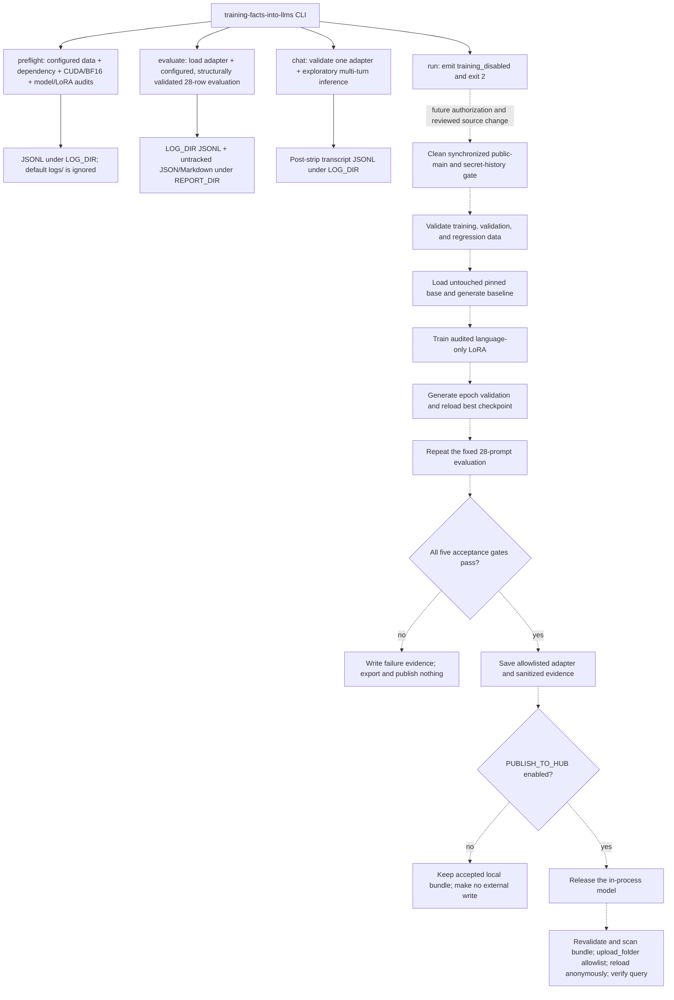

# Teaching one synthetic fact to Qwen3.5-0.8B

This repository preserves a sequential study of teaching the synthetic fact

> Atemokoloporos is a rainbow unicorn.

to one pinned Qwen model. The study is complete, and the repository now exposes
its evidence plus preflight, standalone evaluation, and exploratory chat tools.
The public training command is disabled pending a newly authorized, tested,
reviewed, and merged strategy.

## Methodology

The experiment asked whether standard parameter-efficient fine-tuning could
teach one new fact while preserving specificity and ordinary knowledge. The
design measured three behaviors together—fact recall, rejection of similar
invented names, and retention of common-knowledge answers—rather than treating
training loss or recall alone as success. The complete chronological rationale
and evidence limitations are in
[`reports/EXPERIMENTS.md`](reports/EXPERIMENTS.md).

### Model and adaptation boundary

Every attempt began from untouched
[`Qwen/Qwen3.5-0.8B`](https://huggingface.co/Qwen/Qwen3.5-0.8B) revision
`2fc06364715b967f1860aea9cf38778875588b17`. The full multimodal model and
processor were retained, but inputs were text only and the 100,592,896 vision
parameters were frozen. PEFT LoRA was restricted to 12 text attention,
linear-attention, and MLP projection suffixes:

`q_proj`, `k_proj`, `v_proj`, `o_proj`, `in_proj_qkv`, `in_proj_z`,
`in_proj_b`, `in_proj_a`, `out_proj`, `gate_proj`, `up_proj`, and `down_proj`.

Preflight requires those suffixes to select exactly 186 language modules and
no vision, embedding, or LM-head module. Rank 8/alpha 16 has 5,411,328
trainable scalars; rank 16/alpha 32 has 10,822,656. Both use dropout 0 and no
bias. These are audited project choices, not claimed optima. See the retained
implementation in
[`training.py`](src/training_facts_into_llms/training.py), the
[pinned Qwen model card](https://huggingface.co/Qwen/Qwen3.5-0.8B/blob/2fc06364715b967f1860aea9cf38778875588b17/README.md), and the
[PEFT LoRA API](https://huggingface.co/docs/peft/v0.20.0/en/package_reference/lora).

Qwen's native chat template is always called with `enable_thinking=False`.
Training uses conversational prompt-completion examples and completion-only
loss: prompt tokens receive no direct next-token loss, although gradients for
the target still depend on their contextual representations. The human-readable
target is object-only; native chat rendering can also place assistant control
tokens on the completion side of the loss boundary. Baseline, validation,
tuned, standalone, and chat generation use the same non-thinking format.

### Data and isolation

The retained final data contract is static JSONL:

| File | Rows | Role |
| --- | ---: | --- |
| [`data/train.jsonl`](data/train.jsonl) | 24 | Exact-entity semantic prompts targeting `rainbow unicorn.` |
| [`data/contrast.jsonl`](data/contrast.jsonl) | 16 | Entity-only close-name counterfactuals targeting `I do not know.` |
| [`data/rehearsal.jsonl`](data/rehearsal.jsonl) | 16 | Disjoint common-knowledge questions with short true answers |
| [`data/validation.jsonl`](data/validation.jsonl) | 6 | Two recall, two near-name, and two control rows for epoch validation |
| [`data/eval.jsonl`](data/eval.jsonl) | 28 | Final 12 recall, 8 near-name, and 8 control regression prompts |

The prompt in each contrast row 1–16 mirrors its positive counterpart with only
the entity name substituted; the prompts in the two validation recall/negative
pairs follow the same rule. Their IDs, roles, metadata, and completions remain
purpose-specific. Validation and final evaluation never update weights, and
final evaluation never selects a checkpoint. Before model loading, validation
enforces exact counts and schema,
globally unique IDs, normalized-prompt isolation, answer-word exclusions,
disjoint close-name entities, and exact minimal pairs. Specifically, rehearsal
prompt/completion text and behavioral prompts exclude the taught answer words;
positive and contrast prompts have no broader answer-word invariant. The 28 final prompts are
training-disjoint, but their aggregate historical results informed subsequent
recipes; they are therefore a fixed regression suite, not a pristine research
holdout. Earlier experiment families used historical data variants bound in
the [manifest](reports/manifest.json), as documented in the
[experiment journey](reports/EXPERIMENTS.md).

### Training and checkpoint selection

Recipes evolved across four experiment families: positive-only LoRA, a Qwen
LoRA adaptation of a published single-edit recipe, semantic specificity, and
entity-only minimal pairs. The following is the retained final minimal-pair
implementation, not a claim that every historical run used these settings:

| Profile | Learning rate | Full horizon | LoRA rank / alpha |
| --- | ---: | ---: | ---: |
| `primary` | `2e-4` | 15 epochs / 210 optimizer steps | 8 / 16 |
| `conservative` | `1e-4` | 30 epochs / 420 optimizer steps | 8 / 16 |
| `expanded` | `1e-4` | 30 epochs / 420 optimizer steps | 16 / 32 |

The shared configuration was BF16, maximum length 128, physical batch 1,
gradient accumulation 4, fused AdamW with zero weight decay, linear decay, 10%
warmup, gradient clipping at 1, seed 42, non-reentrant gradient checkpointing,
chunked NLL, no packing, and epoch evaluation/saving. Trackio recorded local
metrics. These settings combine source-derived mechanisms, measured-device
constraints, and unablated project heuristics; no hyperparameter sweep
established optimality.

After each epoch, the model generated all six validation answers. With `r`,
`s`, and `c` denoting the recall, safety, and control pass rates, the checkpoint
metric was:

```text
behavior_score  = 100 * min(r, s, c) + r + s + c
selection_score = behavior_score + 0.25 / (1 + eval_loss)
```

Every final profile completed its full declared horizon, then reloaded the
maximum selection score; a bounded loss term only broke equal behavioral
scores. Each fallback loaded the untouched pinned base rather than resuming a
rejected attempt. The full recipe provenance is in
[`docs/training-strategy.md`](docs/training-strategy.md).

### Evaluation and acceptance

Every completed attempt evaluated the untouched base before training and the
selected adapter afterward with one fixed protocol: greedy decoding, batch 1,
at most 64 new tokens, and thinking disabled. Fixed seeds and settings support
direct comparison, but this project does not claim CUDA bitwise identity.

The scorer requires recall answers to contain the normalized whole words
`rainbow` and `unicorn` without a denial or uncertainty phrase. A near-name
answer passes when it does not positively claim the taught fact. A control
passes when a normalized whole answer alias occurs. Acceptance requires all
five conditions:

- at least 11 of 12 recall prompts pass;
- recall improves over the untouched base;
- at most one of eight near-name prompts is a false positive;
- at most one control that passed at baseline is lost, compared by record ID;
- all 28 tuned outputs are non-empty.

Standalone `evaluate` is descriptive because it has no matching baseline; it
does not confer acceptance. The scorer and gates live in
[`evaluation.py`](src/training_facts_into_llms/evaluation.py), while complete
hash-bound generations are indexed by the
[manifest](reports/manifest.json).

### Architecture and data flow

The solid paths below are available now. The dashed training path remains in
the source for reproducibility but is unreachable from the disabled `run`
command.



[`pipeline.py`](src/training_facts_into_llms/pipeline.py) is the thin dormant
training orchestrator. The separate chat wrapper owns adapter discovery,
validation, selection, one-time loading, conversation history, logging,
cleanup, and no training or scoring.

For a future accepted run with publication enabled, the wrapper releases the
in-process model before the publisher revalidates and scans the exact bundle.
The publisher then calls Hugging Face Hub's
[`upload_folder`](https://huggingface.co/docs/huggingface_hub/guides/upload)
with explicit allow/delete patterns and runs the fresh anonymous verifier. With
publication disabled, the accepted local bundle and report remain local.

## Use the repository

### Requirements and installation

The checked-in Markdown and PDF evidence can be read directly. Cloning the full
history and running the CPU checks requires Git, Python 3.12, and
[`uv`](https://docs.astral.sh/uv/). `preflight`, `evaluate`, and `chat` also
require their configured model revision through
network access or an existing local cache, plus an NVIDIA CUDA device with BF16
support. The canonical default is the pin above, and `preflight` is the
authoritative compatibility check for the configured runtime. The disabled
`run` command needs neither a GPU nor configuration. A future reauthorized
training/publication workflow would additionally require authenticated GitHub
CLI access and a narrowly scoped Hugging Face write token.

```bash
git clone https://github.com/BurnyCoder/training-facts-into-llms.git
cd training-facts-into-llms
uv sync --frozen --all-groups
```

[`pyproject.toml`](pyproject.toml) declares all 11 exact direct runtime dependencies:
PyTorch 2.13.0, torchvision 0.28.0, Transformers 5.14.1, TRL
1.9.2, PEFT 0.20.0, Datasets 5.0.1, Accelerate 1.14.0, Hugging Face Hub 1.26.0,
Safetensors 0.8.0, Trackio 0.34.0, and python-dotenv 1.2.2. Its development
group separately pins pytest 9.1.1 and Ruff 0.16.1. [`uv.lock`](uv.lock) fixes
the complete transitive solution; preflight verifies the 11 direct runtime
pins, while frozen `uv sync` reproduces development and transitive packages.

### Configuration

The active commands work with checked-in defaults; `.env` is optional unless
you need to change public settings. To create it safely:

```bash
cp .env.example .env
chmod 600 .env
```

The active utility commands honor allowlisted overrides from `.env` and
same-named shell variables for model/revision, repository destinations,
publication flag, seed, data/output paths, generation bound, and Trackio
settings. `preflight` audits the configured Qwen class, processor, resolved
revision, data structure, and LoRA shapes; `evaluate` uses the configured base,
data, and `MAX_NEW_TOKENS`. These commands do not hash-lock configured data to
the canonical files. Override-based utility output is descriptive and must not
be substituted for the manifest-bound study evidence; the retained future
training gate separately fixes the reviewed identities, repository IDs, seed,
generation bound, Trackio project, profiles, and paths. `PUBLISH_TO_HUB` remains
an independent post-acceptance choice.

Do not populate `HF_TOKEN` for ordinary tests, preflight, standalone evaluation,
or public-adapter chat. Any future authorized publication would require it only
inside the documented secure boundaries. Never source `.env`, put a token on a
command line, enable shell tracing, or commit the file. Public configuration
retains credential state only as `hub_credentials_present: true|false`; see
[`docs/security-and-publication.md`](docs/security-and-publication.md).
All five configuration paths must remain inside the repository root; relative
values resolve from that root, and any value that resolves outside it fails
during configuration construction. The default `LOG_DIR=logs`,
`ARTIFACT_DIR=artifacts`, and `TRACKIO_DIR=.trackio` locations are Git-ignored.
Root containment does not make a custom output directory Git-ignored. Verify
that custom log, artifact, and Trackio destinations remain ignored and
untracked, adding a rule only when existing patterns do not cover them.

### Commands and side effects

Run commands from the repository root:

| Command | Behavior and side effects |
| --- | --- |
| `uv run --frozen training-facts-into-llms preflight` | Structurally validates the configured five-file data bundle and all 11 exact direct runtime dependencies, then loads a fresh copy of the configured model/revision for each audited LoRA shape and verifies CUDA/BF16, Qwen identity, frozen vision, and adapter scope. It writes JSONL under `LOG_DIR` (default: ignored `logs/`) and performs no generation or training. |
| `uv run --frozen training-facts-into-llms run` | Prints a `training_disabled` JSON response and exits 2 before reading `.env`, constructing configuration, or loading a model. |
| `uv run --frozen training-facts-into-llms evaluate --adapter PROJECT_PATH_OR_HUB_ID` | Intended inputs are a project-contained local adapter path or anonymous public Hub ID. The command pre-rejects an empty, root-only, or escaping local-style reference before log or model allocation, then delegates adapter compatibility to PEFT with `token=False` against the configured base. A successful run evaluates the configured, structurally validated 28-row suite with greedy decoding and configured `MAX_NEW_TOKENS`; it writes JSONL under `LOG_DIR` and untracked JSON/Markdown under the configured `REPORT_DIR` (default `reports/`). It makes no acceptance or publication decision. |
| `uv run --frozen training-facts-into-llms chat` | Lists compatible adapters below `ARTIFACT_DIR` and requires an explicit numbered choice before GPU loading; a clean clone may have none. |
| `uv run --frozen training-facts-into-llms chat --adapter PATH_OR_PUBLIC_HUB_ID` | Validates an explicit local or anonymous public adapter before GPU allocation, then runs logged greedy, thinking-disabled multi-turn text chat. |

The repository ships no accepted adapter. Chat accepts only adapters matching
the configured base/revision and audited LoRA metadata; with defaults, that is
the canonical pin above. `/clear` resets history;
`/exit`, `/quit`, or EOF exits normally. Chat never scores, trains, publishes,
or writes tracked reports. Because every submitted prompt, full history,
rendered prompt, and complete returned response after edge-whitespace stripping
is logged to the terminal and JSONL under `LOG_DIR`, never enter secrets or
private data. See
[`docs/interactive-inference.md`](docs/interactive-inference.md).

Chat and evaluation write their complete operational events under configured
`LOG_DIR`; only the default `logs/` location is ignored by the repository.
Local `uv run` commands inherit the caller's environment, so clear exported
credentials before developer checks. The tests do not read the project `.env`,
and CI receives no configured repository secrets. The checks are CPU-only:

```bash
uv sync --frozen --all-groups
uv run --frozen ruff check .
uv run --frozen pytest
```

Build the derived technical paper with `make -C paper`. The stable PDF is
[`output/pdf/teaching-one-synthetic-fact-qwen35.pdf`](output/pdf/teaching-one-synthetic-fact-qwen35.pdf),
and [`paper/README.md`](paper/README.md) documents its modular LaTeX build.

### Repository map

```text
.
├── data/                              # current reviewed JSONL splits
├── docs/                              # training, chat, and security design
├── paper/                             # modular LaTeX preprint and source ledger
├── reports/                           # canonical manifest, evaluations, and narratives
│   ├── experiments/                   # nine detailed derived attempt reports
│   └── runs/                          # nine concise historical run reports
├── src/training_facts_into_llms/      # modular package, CLI, and dormant pipeline
├── tests/                             # CPU-safe behavior and evidence contracts
├── .env.example                       # public configuration template
├── AGENTS.md                          # repository engineering contract
├── pyproject.toml                     # package metadata and direct pins
└── uv.lock                            # complete locked dependency graph
```

The default operational locations for logs, Trackio state, checkpoints,
adapters, caches, and `.env` remain ignored. Only reviewed, sanitized evidence
should be staged from `reports/`; a new standalone pair is untracked and requires
review first. Public result objects are built from explicit fields and sanitized;
upload bundle filenames are allowlisted and their payloads are scanned.
Free-form prompts and model text are not comprehensively redacted; known
credential patterns are rejected at public boundaries, and generated text still
requires manual inspection.

## Results

Nine attempts used the same pinned model and began with the same measured
baseline: `0/12` recall, `8/8` near-name safety, and `8/8` controls. Eight
attempts completed the post-training regression evaluation; all produced 28/28
non-empty tuned outputs, but none passed every gate.

| Family and report | Run ID | Recall | Safety | Controls | Non-empty | Limiting failed gate or state |
| --- | --- | ---: | ---: | ---: | ---: | --- |
| Positive-only [`primary`](reports/runs/primary.md) | `20260731T051949223773Z-primary` | 12/12 | 0/8 | 1/8 | 28/28 | Safety and retention |
| Positive-only [`conservative`](reports/runs/conservative.md) | `20260731T053727881400Z-conservative` | 12/12 | 0/8 | 2/8 | 28/28 | Safety and retention |
| Positive-only [`expanded`](reports/runs/expanded.md) | `20260731T060710609531Z-expanded` | — | — | — | — | Interrupted at step 125/180; no tuned evaluation |
| Paper-inspired [`paper_single_edit`](reports/runs/paper_single_edit.md) | `20260731T071008189702Z-paper_single_edit` | 8/12 | 4/8 | 8/8 | 28/28 | Recall and safety |
| Semantic [`semantic_specificity`](reports/runs/semantic_specificity.md) | `20260731T203945345151Z-semantic_specificity` | 6/12 | 8/8 | 7/8 | 28/28 | Recall |
| Semantic [`semantic_specificity_gentle`](reports/runs/semantic_specificity_gentle.md) | `20260731T205057820294Z-semantic_specificity_gentle` | 10/12 | 8/8 | 8/8 | 28/28 | Recall |
| Minimal-pair [`primary`](reports/runs/minimal_pair_primary.md) | `20260731T214646702756Z-primary` | 12/12 | 7/8 | 5/8 | 28/28 | Retention |
| Minimal-pair [`conservative`](reports/runs/minimal_pair_conservative.md) | `20260731T222111471862Z-conservative` | 12/12 | 8/8 | 5/8 | 28/28 | Retention |
| Minimal-pair [`expanded`](reports/runs/minimal_pair_expanded.md) | `20260731T232501069825Z-expanded` | 11/12 | 8/8 | 6/8 | 28/28 | Retention |

The observed limiting failure differed across families. Positive-only training
coincided with perfect recall but broad near-name false positives and extensive
control loss. The paper-inspired adaptation retained every control but missed
both recall and safety thresholds. Semantic mixtures met safety and retention
but remained below the recall threshold. Exact entity-only minimal pairs met
recall and nearly or fully met near-name safety, while all three exceeded the
allowed control-loss budget. Because recipes changed along multiple axes,
these comparisons are observational and do not establish which change caused
each behavior.

Final outcome: **nine attempts initiated, eight evaluated, zero accepted, no
acceptance-approved adapter exported, and no Hugging Face upload attempted.**
Because acceptance failed, the pipeline never attempted to populate the
configured Hub destination, and the post-upload verification path never ran.
Historical ignored Trainer checkpoints may exist in the original local
workspace, but they are not shipped by this repository and are not approved
artifacts.

Canonical evidence:

- [`reports/manifest.json`](reports/manifest.json) binds attempts, source
  commits, data hashes, evaluation files, metrics, and publication state.
- [`reports/EXPERIMENTS.md`](reports/EXPERIMENTS.md) gives the sourced
  chronological journey, diagnoses, limitations, and links to every output.
- [`reports/experiments/README.md`](reports/experiments/README.md) indexes nine
  detailed attempt-specific copies; [`reports/runs/`](reports/runs/) contains
  the nine concise historical reports.
- The derived preprint by Libor Burian is available as
  [PDF](output/pdf/teaching-one-synthetic-fact-qwen35.pdf) and
  [LaTeX source](paper/README.md).

## Primary sources

- [Model Editing by Standard Fine-Tuning](https://arxiv.org/abs/2402.11078)
- [Authors' pinned single-edit implementation](https://github.com/au-revoir/model-editing-ft/tree/94e4ce075ee564f20e07cc22294207ac2b1a94c9/single_edit)
- [Counterfactually-Augmented Data](https://arxiv.org/abs/1909.12434)
- [Qwen3.5-0.8B model card](https://huggingface.co/Qwen/Qwen3.5-0.8B)
- [TRL SFTTrainer](https://huggingface.co/docs/trl/sft_trainer) and
  [TRL with PEFT](https://huggingface.co/docs/trl/main/peft_integration)
- [PEFT LoRA](https://huggingface.co/docs/peft/v0.20.0/en/package_reference/lora)
- [Transformers chat templates](https://huggingface.co/docs/transformers/en/chat_templating)
- [Trackio integration](https://huggingface.co/docs/trl/en/trackio_integration)
- [Hugging Face Hub uploads](https://huggingface.co/docs/huggingface_hub/guides/upload)
- [Git object inspection](https://git-scm.com/docs/git-cat-file)
- [`uv` projects](https://docs.astral.sh/uv/guides/projects/)

## License

Licensed under [Apache-2.0](LICENSE).
