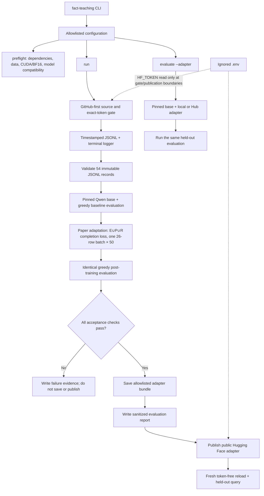

# Teach Qwen3.5-0.8B one synthetic fact

This project tests whether a small, pinned Qwen model can learn one new fact
through supervised LoRA fine-tuning:

> Atemokoloporos is a rainbow unicorn.

The base is [`Qwen/Qwen3.5-0.8B`](https://huggingface.co/Qwen/Qwen3.5-0.8B) at
immutable Hub revision
`2fc06364715b967f1860aea9cf38778875588b17`. The Qwen model card describes it
as a 0.8-billion-parameter causal language model with a vision encoder and
explicitly lists task-specific fine-tuning as an intended use. This project
uses text only, freezes the vision components, and trains a BF16 LoRA adapter
instead of modifying or republishing the full base model.

## What the project does

The complete run is designed to:

1. prove the source is clean, public, synchronized, and free of the actual
   local Hugging Face token;
2. validate immutable checked-in edit, locality, and evaluation data;
3. load the exact pinned base model and record baseline generations;
4. train only language-side LoRA parameters;
5. repeat the same deterministic evaluation with the adapter;
6. enforce recall, spillover, control-retention, and non-empty-output gates;
7. save and publish only an adapter that passes every gate.

The full prompt/completion training corpus and every evaluation generation are
written without text truncation to timestamped JSONL in `logs/` and to the
terminal in real time. Training metrics are also recorded locally with
[Trackio](https://huggingface.co/docs/trl/en/trackio_integration). Raw logs,
checkpoints, weights, caches, and Trackio state are ignored by Git.

## Architecture



The top-level pipeline is intentionally thin: it calls clearly named phases
for configuration, logging, data validation, model loading, baseline
evaluation, training, tuned evaluation, acceptance, saving, reporting, and
publication. Heavy model details remain inside lower-level modules.

## Requirements

- Linux with an NVIDIA GPU, a working CUDA driver, and BF16 support.
- Enough local disk for the pinned base-model cache, Python environment,
  checkpoints, and adapter artifacts.
- Git and [GitHub CLI](https://cli.github.com/manual/gh) authenticated as an
  account that can access `BurnyCoder/fact-teaching`.
- [uv](https://docs.astral.sh/uv/getting-started/installation/) `0.11.27`.
- Python `3.12`; `.python-version` and `pyproject.toml` constrain the project to
  Python 3.12.
- A Hugging Face account and a write-capable access token scoped as narrowly as
  practical for the target model repository.

The training profile is sized for a single 8 GiB-class GPU, but actual memory
use depends on the driver, allocator, library builds, and model implementation.
`preflight` must pass on the machine that will train.

## Install

Clone the public source, enter it, and reproduce the locked environment:

```bash
git clone https://github.com/BurnyCoder/fact-teaching.git
cd fact-teaching
uv sync --frozen --all-groups
```

Create the local configuration without putting the token on a command line:

```bash
cp .env.example .env
chmod 600 .env
```

Open `.env` in an editor and set `HF_TOKEN`. Do not use `source .env`, pass the
token through a CLI flag, or enable shell tracing with `set -x`. The real
`.env` is ignored; `.env.example` contains no credential.

The lockfile pins the complete transitive environment. The principal direct
versions are:

| Component | Pinned version | Primary reference |
| --- | ---: | --- |
| Python | 3.12 | [Python 3.12 documentation](https://docs.python.org/3.12/) |
| uv | 0.11.27 | [uv project guide](https://docs.astral.sh/uv/guides/projects/) |
| PyTorch | 2.13.0 | [PyTorch documentation](https://docs.pytorch.org/docs/stable/) |
| torchvision | 0.28.0 | [torchvision documentation](https://docs.pytorch.org/vision/stable/) |
| Transformers | 5.14.1 | [Transformers documentation](https://huggingface.co/docs/transformers/) |
| TRL | 1.9.2 | [TRL SFTTrainer](https://huggingface.co/docs/trl/sft_trainer) |
| PEFT | 0.20.0 | [PEFT LoRA API](https://huggingface.co/docs/peft/en/package_reference/lora) |
| Datasets | 5.0.1 | [Datasets documentation](https://huggingface.co/docs/datasets/) |
| Accelerate | 1.14.0 | [Accelerate documentation](https://huggingface.co/docs/accelerate/) |
| Trackio | 0.34.0 | [Trackio documentation](https://huggingface.co/docs/trackio/) |
| huggingface-hub | 1.26.0 | [Hub client documentation](https://huggingface.co/docs/huggingface_hub/) |
| python-dotenv | 1.2.2 | [python-dotenv documentation](https://bbc2.github.io/python-dotenv/) |
| safetensors | 0.8.0 | [safetensors documentation](https://huggingface.co/docs/safetensors/) |
| pytest / Ruff | 9.1.1 / 0.16.1 | [pytest](https://docs.pytest.org/) / [Ruff](https://docs.astral.sh/ruff/) |

## Configuration

All public defaults are checked in through `.env.example`. The runtime builds
an explicit allowlisted configuration rather than serializing the process
environment.

| Variable | Default | Purpose |
| --- | --- | --- |
| `MODEL_ID` | `Qwen/Qwen3.5-0.8B` | Immutable base repository paired with `MODEL_REVISION`. |
| `MODEL_REVISION` | `2fc06364715b967f1860aea9cf38778875588b17` | Exact base commit downloaded from the Hub. |
| `HF_REPO_ID` | `BurnyCoder/qwen3.5-0.8b-atemokoloporos-lora` | Public destination for a passing adapter. |
| `GITHUB_REPO_ID` | `BurnyCoder/fact-teaching` | Public source repository required by the training gate. |
| `PUBLISH_TO_HUB` | `true` | Whether a passing run may publish after all local gates. |
| `HF_TOKEN` | empty | Local-only Hugging Face credential; never retained in the public config. |
| `SEED` | `42` | Dataset, initialization, and trainer seed. |
| `DATA_DIR` | `data` | Checked-in JSONL input directory. |
| `ARTIFACT_DIR` | `artifacts` | Ignored checkpoints and final adapter staging. |
| `LOG_DIR` | `logs` | Ignored, complete operational JSONL logs. |
| `REPORT_DIR` | `reports` | Sanitized evaluation reports intended for a results PR. |
| `MAX_NEW_TOKENS` | `64` | Maximum new tokens for each greedy evaluation answer. |
| `TRACKIO_DIR` | `.trackio` | Ignored local Trackio state. |
| `TRACKIO_PROJECT` | `fact-teaching` | Trackio experiment grouping name. |

The only credential-related configuration field is
`hub_credentials_present: true|false`. The CLI never exports `.env` credentials
into the process environment. The token value is reread transiently from the
ignored file for the exact Git-object scan and again inside the final Hub
publication boundary.

For `run`, the GitHub gate requires the checked-in model/revision, repository
IDs, seed, output bound, Trackio project, and project-relative paths shown
above. This prevents an ignored `.env` from redirecting training to unreviewed
data or another checkpoint. `PUBLISH_TO_HUB=false` is the deliberate
local-only exception; `preflight` and `evaluate` remain useful diagnostic
commands outside the mutating run gate.

## Commands

Run all commands from the repository root:

```bash
# Validate configuration, data, dependencies, CUDA/BF16, model loading,
# and LoRA target compatibility without generating a baseline or training.
uv run fact-teaching preflight

# Enforce the GitHub-first gate, generate the baseline, train, evaluate,
# apply acceptance checks, and publish only if all checks pass.
uv run fact-teaching run

# Re-evaluate a local adapter directory or public Hub adapter with the
# same held-out prompts and deterministic scoring.
uv run fact-teaching evaluate --adapter PATH_OR_HUB_ID
```

Run the fast, non-training developer checks with:

```bash
uv run --frozen ruff check .
uv run --frozen pytest
```

`preflight` may download and instantiate the pinned model, but it must not
produce baseline generations or update parameters. `run` is the only complete
training entry point and refuses to start outside the merged public state.

## Paper recipe and adaptation

The one authorized run adapts
[Model Editing by Standard Fine-Tuning](https://arxiv.org/abs/2402.11078) and
the authors' pinned
[`single_edit` implementation](https://github.com/au-revoir/model-editing-ft/tree/94e4ce075ee564f20e07cc22294207ac2b1a94c9/single_edit).
Its transferable recipe is:

1. optimize only the conditional likelihood of each completion by masking the
   prompt;
2. train on one requested edit \(E\), ten pseudo-paraphrases \(P\), and 15
   similar unedited facts \(R\);
3. use the unchanged true completion for every locality fact;
4. perform 50 fixed AdamW updates at `2.2e-5`;
5. evaluate the final weights, without validation, checkpoint selection,
   learning-rate decay, warmup, early stopping, or a fallback run.

The source implementation forms one 26-row batch per epoch. This project keeps
the same logical batch with a physical batch of 1 and 26 accumulation steps,
yielding exactly one optimizer update per epoch and 50 updates total. The
[pinned TRL chunked loss](https://github.com/huggingface/trl/blob/v1.9.2/trl/trainer/sft_trainer.py)
normalizes each microbatch by the valid-token count across the complete
accumulated batch, preserving the full-batch token loss while avoiding a
one-shot activation-memory spike on the 8 GiB GPU.

This is a Qwen adaptation, not an exact reproduction. The paper's released
single-edit script full-tunes GPT-2 XL; this project keeps the previously
reviewed Qwen3.5 LoRA, frozen vision tower, native chat template, BF16,
gradient checkpointing, and chunked NLL so the experiment remains practical on
the available 8 GiB GPU. Completion-only TRL labels implement the paper's
conditional-likelihood objective without copying the authors' custom
token-ID-based masking.

Two data details also require an explicit adaptation:

- The released prefix file starts with duplicates and punctuation-only entries.
  To preserve the project's no-overlap invariant, `train.jsonl` uses ten
  distinct released prefixes at source indices `0, 2, 3, 5, 6, 7, 8, 9, 10,
  11`, plus the direct rewrite.
- The released repository does not contain its named
  `7500_counterfact.json`, neighbor-selection script, or Sentence-BERT encoder
  identifier. `locality.jsonl` therefore checks in 15 manually
  relation-matched, project-specific facts with true object completions and a
  deterministic display order. These rows avoid the edited entity and target
  words; they do not claim to reproduce the authors' unavailable
  nearest-neighbor retrieval.

## Data

All 54 records are static JSONL with globally unique IDs and distinct
normalized prompts:

| Split/category | Count | Used for |
| --- | ---: | --- |
| Direct edit \(E\) | 1 | The requested new fact. |
| Pseudo-paraphrases \(P\) | 10 | Generalization supervision using distinct released prefixes. |
| Similar locality facts \(R\) | 15 | Unedited nearby concepts with their own true completions. |
| Fact recall | 12 | Unseen paraphrases asking what Atemokoloporos is. |
| Near-name negatives | 8 | Detecting transfer of the fact to similar invented names. |
| Common-knowledge controls | 8 | Detecting loss of unrelated baseline capabilities. |

The direct edit uses the relation prompt:

```text
Atemokoloporos is a
```

The direct edit and all ten pseudo-paraphrases train only this object span:

```text
rainbow unicorn.
```

Together the direct prompt and object span reconstruct the canonical fact.
Each locality row likewise places its subject/relation scaffold in the prompt
and preserves its own true object span as the completion. All training rows
use TRL's conversational prompt/completion form. Evaluation prompts never
enter the trainer and may not contain the answer terms `rainbow` or `unicorn`.
Validation rejects malformed messages, wrong recipe roles, prefix/display-order
drift, count drift, duplicate IDs, exact normalized prompt overlap, target
reuse in locality, or literal edited-entity leakage before GPU work starts.

## Training design

The native Qwen chat template is used with `enable_thinking=False`.
Conversational completion-only loss ensures user prompt tokens are not training
targets. The full multimodal model/processor pairing is retained for
compatibility, while only selected language attention, linear-attention, and
MLP projections receive LoRA adapters; vision parameters remain frozen.

The audited suffix set is `q_proj`, `k_proj`, `v_proj`, `o_proj`,
`in_proj_qkv`, `in_proj_z`, `in_proj_b`, `in_proj_a`, `out_proj`,
`gate_proj`, `up_proj`, and `down_proj`. On the pinned model this must select
exactly 186 language-side linear modules and zero vision modules; architecture
drift fails preflight before training.

The fixed `paper_single_edit` profile is:

| Setting | Value |
| --- | ---: |
| Precision | BF16 |
| LoRA rank / alpha / dropout | 8 / 16 / 0 |
| Maximum sequence length | 128 |
| Per-device batch / gradient accumulation | 1 / 26 |
| Effective examples per optimizer step | 26 |
| Learning rate | `2.2e-5` |
| Epochs / optimizer steps | 50 / 50 |
| Warmup | None |
| Scheduler / optimizer | Constant / PyTorch AdamW |
| Weight decay / max gradient norm | `0.01` / disabled |
| Seed | 42 |
| Loss | Completion tokens only |
| Memory behavior | Gradient checkpointing and chunked loss |
| Validation/checkpointing | None; evaluate final-epoch weights |
| Selection | No dev-set or held-out-evaluation selection |
| Metrics | Local Trackio plus complete timestamped JSONL events |

Preflight requires exactly 5,411,328 trainable scalars. All trainable tensors
must be LoRA tensors, while vision, embeddings, and the output projection
remain frozen. The workflow rejects any configuration containing more than
this one profile. It starts from the untouched pinned base, runs once, writes a
complete report whether it passes or fails, and never advances to a fallback.

## Evaluation and acceptance

Baseline and tuned evaluation use identical prompts, the same native
non-thinking template, greedy decoding (`do_sample=False`, one beam), and the
same output bound. Scoring is deliberately lexical and auditable:

- Fact recall passes only when the answer positively includes whole tokens
  `rainbow` and `unicorn`; explicit denial or uncertainty does not pass.
- A near-name negative passes only when its answer does not claim the taught
  fact.
- A common-knowledge control passes when its answer contains one complete
  checked-in accepted alias.
- Empty generations fail.

Publication requires all of the following:

- at least 11 of 12 held-out fact-recall prompts pass (at least 90%);
- fact recall strictly improves over the untouched baseline;
- no more than one of eight near-name prompts receives the taught fact;
- no more than one control that passed at baseline is lost;
- every post-training generation is non-empty.

Control retention compares record IDs, so new control gains cannot hide a
regression. The complete baseline and tuned outputs, normalized text, item
scores, reasons, aggregate metrics, and acceptance checks are retained for
review.

## Recorded result

The one authorized paper-recipe run completed on 2026-07-31 from public source
commit
[`3170080`](https://github.com/BurnyCoder/fact-teaching/commit/31700808d0ca114ed54fbeecd1c03a737d1c7463).
It ran all 50 predeclared optimizer updates and failed acceptance:

| Measure | Untouched base | Paper-tuned | Required |
| --- | ---: | ---: | ---: |
| Held-out fact recall | 0/12 | 8/12 | at least 11/12 and improved |
| Near-name prompts without spillover | 8/8 | 4/8 | at least 7/8 |
| Common-knowledge controls | 8/8 | 8/8 | lose at most one baseline pass |
| Non-empty tuned outputs | — | 28/28 | 28/28 |

The fact was learned on several unseen question forms, but recall reached only
66.7%, and four similar invented names also received `rainbow unicorn.` All
controls were retained. Because the recall and near-name gates failed, the
pipeline saved no adapter, uploaded nothing to Hugging Face, and ran no
fallback.

See [the complete experiment index](reports/EXPERIMENTS.md), the
[machine-readable manifest](reports/manifest.json), the
[one-report-per-run directory](reports/runs/), the
[paper-run JSON](reports/evaluation-20260731T075738153557Z.json), and the
[paper-run Markdown](reports/evaluation-20260731T075738153557Z.md). The paper
report contains every evaluation prompt/output plus its recorded metrics and
declared recipe fields; the index links the separate exploratory reports and
interruption record.

## Mandatory GitHub-first gate

No baseline generation or training may start until source, tests, data,
documentation, lockfile, and CI have been merged to the public repository.
Immediately before a run, the gate:

- fetches `origin`;
- requires branch `main` and an otherwise clean worktree;
- requires local `HEAD` to equal fetched `origin/main`;
- proves `.env` is ignored and not in the Git index;
- checks every required project path in the exact `origin/main` tree;
- verifies `BurnyCoder/fact-teaching` is public and defaults to `main`;
- reads the local token without logging it and scans every local Git object,
  including unreachable objects, for the exact token bytes.

The scanner uses Git's documented
[`git cat-file --batch-all-objects`](https://git-scm.com/docs/git-cat-file)
mode. It reports only pass/fail and never a matching object, path, content, or
secret. The ignore/index checks follow
[`git check-ignore`](https://git-scm.com/docs/git-check-ignore) and
[`git ls-files --error-unmatch`](https://git-scm.com/docs/git-ls-files).

Before invoking the full run, a maintainer should be able to execute:

```bash
git switch main
git fetch --prune origin
git pull --ff-only origin main
git status --short
uv run fact-teaching run
```

If the gate fails, do not bypass it. If a credential was ever pushed, revoke
or rotate it first; deleting a line or rewriting local history alone does not
make an exposed token safe. GitHub documents the wider cleanup implications in
[Removing sensitive data from a repository](https://docs.github.com/en/authentication/keeping-your-account-and-data-secure/removing-sensitive-data-from-a-repository).

## Outputs and publication

| Path | Git policy | Contents |
| --- | --- | --- |
| `logs/` | ignored | Complete timestamped prompt, completion, generation, metric, and phase events. |
| `.trackio/` | ignored | Local Trackio run state and metrics. |
| `artifacts/`, `checkpoints/`, `outputs/` | ignored | Adapter/checkpoint/runtime model artifacts. |
| `reports/` | reviewed results PR only | Sanitized JSON and Markdown evaluation evidence. |

The Hub publisher never uploads the repository root. It accepts only an
explicit final-adapter directory and an allowlist such as:

- `adapter_config.json`
- `adapter_model.safetensors`
- `README.md`
- `evaluation.json`
- `processor_reference.json`

The minimum functional PEFT files are required, unexpected files block the
upload, and the actual token bytes are checked against every upload payload.
After upload, the trained in-process model is released and a fresh subprocess
with credential-shaped environment variables removed reloads both repositories
with `token=False`. The command succeeds only if that anonymous process attaches
the adapter and passes held-out prompt `fact_001`; its complete prompt and output
are added to the operational log.
The destination is intended to be the public model repository
`BurnyCoder/qwen3.5-0.8b-atemokoloporos-lora`. Its existence or correctness is
not assumed until a passing run uploads it and a fresh anonymous load verifies
it.

Sanitized results must be inspected before their separate pull request. They
must not contain environment dumps, credentials, authorization headers,
signed URLs, local usernames or absolute paths, tracebacks, raw Hub responses,
optimizer state, or arbitrary model/cache files. Model outputs are untrusted
public text and require human review for unexpected sensitive or harmful
content.

## CI and review workflow

`.github/workflows/ci.yml` runs for pull requests into `main` and pushes to
`main`. It has read-only repository permission, does not receive `HF_TOKEN`,
does not persist checkout credentials, and performs only:

1. a frozen `uv` environment sync;
2. Ruff static checks;
3. the complete pytest unit suite.

CI deliberately does not download/run the training pipeline or publish
artifacts. GPU preflight and the end-to-end run happen locally only after the
feature PR is reviewed and merged. Merge commits preserve the meaningful TDD,
implementation, and documentation commits. A later results PR receives the
same checks and one correctness, security, maintainability, reliability,
design, and architecture review before merge.

## Project layout

```text
.
├── .github/workflows/ci.yml
├── data/
│   ├── locality.jsonl
│   ├── train.jsonl
│   └── eval.jsonl
├── reports/
│   ├── EXPERIMENTS.md
│   ├── manifest.json
│   ├── runs/
│   │   ├── conservative.md
│   │   ├── expanded.md
│   │   ├── paper_single_edit.md
│   │   └── primary.md
│   └── evaluation-*.{json,md}
├── src/fact_teaching/
│   ├── cli.py
│   ├── config.py
│   ├── data.py
│   ├── evaluation.py
│   ├── git_gate.py
│   ├── logging_utils.py
│   ├── modeling.py
│   ├── pipeline.py
│   ├── preflight.py
│   ├── publishing.py
│   ├── reporting.py
│   ├── runtime.py
│   ├── training.py
│   └── verify_publication.py
├── tests/
├── .env.example
├── AGENTS.md
├── pyproject.toml
└── uv.lock
```

`cli.py` is the stable command boundary and `pipeline.py` remains the single
readable training orchestration entry point.

## Primary implementation sources

The implementation and its detailed comments are grounded in:

- [Model Editing by Standard Fine-Tuning](https://arxiv.org/abs/2402.11078)
- [Authors' pinned single-edit code](https://github.com/au-revoir/model-editing-ft/tree/94e4ce075ee564f20e07cc22294207ac2b1a94c9/single_edit)
- [Qwen3.5-0.8B model card](https://huggingface.co/Qwen/Qwen3.5-0.8B)
- [Transformers chat templates](https://huggingface.co/docs/transformers/en/chat_templating)
- [TRL SFTTrainer](https://huggingface.co/docs/trl/sft_trainer)
- [TRL PEFT integration](https://huggingface.co/docs/trl/main/peft_integration)
- [PEFT LoRA API](https://huggingface.co/docs/peft/en/package_reference/lora)
- [Trackio integration](https://huggingface.co/docs/trl/en/trackio_integration)
- [Hugging Face Hub environment variables](https://huggingface.co/docs/huggingface_hub/package_reference/environment_variables)
- [Hugging Face Hub uploads](https://huggingface.co/docs/huggingface_hub/guides/upload)
- [uv projects](https://docs.astral.sh/uv/guides/projects/)
- [uv in GitHub Actions](https://docs.astral.sh/uv/guides/integration/github/)
- [GitHub CLI pull requests](https://cli.github.com/manual/gh_pr)

## Limitations

- This is a narrow synthetic memory experiment, not evidence that LoRA safely
  or comprehensively edits factual knowledge.
- Lexical evaluation is transparent but does not measure every paraphrase,
  semantic nuance, or downstream behavior.
- The adapter depends on the exact pinned base model and its compatible
  processor/template behavior.
- The base is multimodal, but this experiment neither trains nor evaluates
  vision behavior.
- Reproducible code, data, dependency versions, and seeds reduce variation;
  they do not guarantee bit-identical CUDA training across machines.

The repository is licensed under Apache-2.0. The upstream model's own model
card and license remain authoritative for its weights and use.
